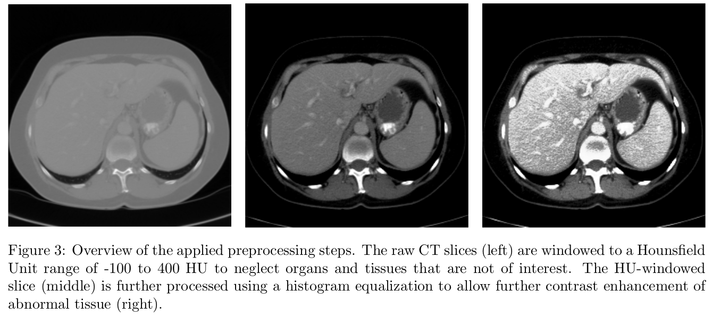
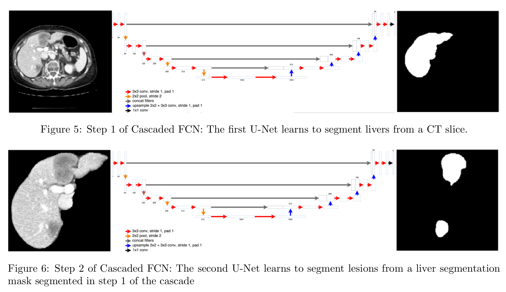
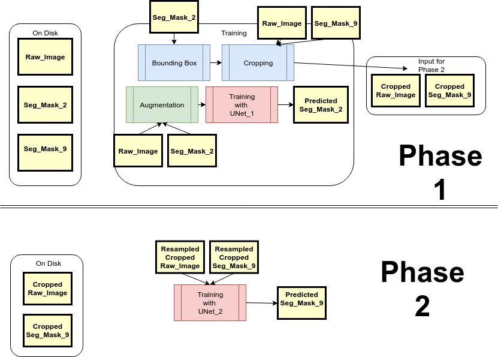

# What this Repo is about

Semantic Segmentation is done by assigning each pixel in the image a class. This is a key problem in th field of computer vision. In this repo, we would look at using Cascaded FCN[1] to do this:

## Set up
Get Ananconda (download from [here](https://anaconda.org/anaconda/python))
```
git clone https://github.com/notha99y/CascadedFCN.git
conda env create -f=environment.yml
```
## To Launch Jupter notebook
```
jupyter notebook &
```
## Test data

TODO

## Data cleaning

1. `rename-files.py` to clean file names
2. `augmentor.py` to augment images for training
3. `boundingbox.py` to create cropped images for training and testing
4. `find . -name '*.DS_Store' -type f -delete` to remove .DS_Store files generated my macOS

## What is Cascaded FCN
The paper [1] suggest a novel approach to segment liver and lesions from Computed Tomography (CT) and Magnetic Resonance Imaging (MRI) images. <br>
There are 3 main steps:
1. Preprocessing (ref to figure3)
 - HU windowing for CT and N4Boas correction for MRI
 - Histogram Equalization
 - Augmentation (mirror, crop, elastic deformation, addition of noise)
2. 2-cascaded FCN (ref to figure6)
 - First segments liver
 - Then segments the leisons
3. Post processing
 - 3D Conditional Random Field





## How we are doing it
Since our images are RGB, we are not going to do the HU windowing/N4Bias Correction nor Histogram Equalization. <br>
We are just using Augmentation by [Augmentor](http://augmentor.readthedocs.io/en/master/) because we find that the Off-the-shelf Augmentation by Tensorflow has some artifacts (Extrapolation of pixels which makes images look funny). We are employing:
- Rotation and automatic Zoom
- Zoom
- Flipping Vertically and Horizontally
- Shearing
<br>
After doing the augmentation, we are going feed the UNet with the masks and images <br>
Due to memory limitation, we are using the .flowfromdirectory method from the ImageDataGenerator Class which reads batches of images and masks pairs from disk into memory. However, the off-the-shelf onehotencoding has some memory problem too, so some time was spent to do the onehotencoding after reading in the images and masks per batch.<br>
Below is an overview on how we are implementing the paper for our own use case


## Training

`src/train.py`

## Augmentation
TODO
## Bounding Box
TODO
## Prediction Phase 1
TODO
## Prediction Phase 2
TODO
## Reference

[1] Automatic Liver and Tumor Segmentation of CT and MRI Volumes using Cascaded Fully Convolutional Neural Networks [white paper here](https://arxiv.org/abs/1702.05970)
